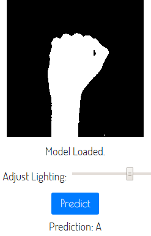
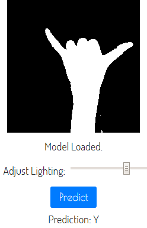
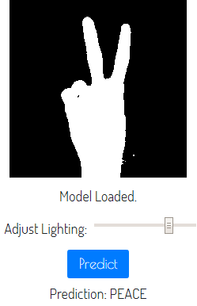
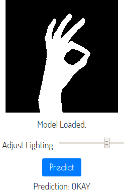
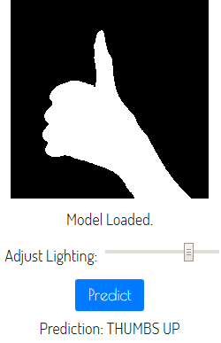

# Hand Gesture Estimation

A model for sign recognition using Transfer Learning with the MobileNet model. MobileNets are simple and light weight yet very efficient models which work on mobile and can be used for computer vision.

A second model was built which takes in as input the output of an internal activation from one of the last layers of the MobileNet model. This was chosen as the layers towards the end learn more features as compared to the layers before.

As of now, the model only recognizes 5 signs, 2 letters namely `A` and `Y` and 3 words namely `PEACE`, `OKAY` and `THUMBS UP`.

Try it out [here](https://mohammed-shoaib.github.io/Watch-Me-Build/Projects/Hand%20Gesture%20Estimation/)!

### Letters




### Words





# Run The Code

Extract the `Images` zip file in the `data` folder and then run the following commands on the terminal:
```bash
python image_to_json.py
python data_to_pickle.py
python keras_model.py
```
Please note that the whole process may take some time.

# Architecture

The MobileNet model with `alpha=0.25` was chosen due it's properties. The model is more light weight as compared to its other versions and hence is more computationally efficient.

For the second model, to summarize, shown below is the architecture:
* `2D Convolutional Layer`
* `2D Max Pooling Layer`
* `2D Convolutional Layer`
* `2D Max Pooling Layer`
* `Flatten Layer`

The MobileNet model takes as input an image of shape `224×224×3` where the last dimension specifies the number of color channels which is 3 for an RGB image. For simplicity, GRAYSCALE images were used with duplication of values along the axes for conversion to RGB. The MobileNet layer `conv_pw_13_relu` outputs an internal activation of shape `7×7×256`. The second model takes as input this shape and outputs a one-hot encoded array of length `NUM_CLASSES` in this case 5 classes.


# Model Deployment

The model was trained using `Keras` with `TensorFlow` as backend. It was trained over a span of 30 Epochs with an accuracy of over **98%** on the Test set. The data for the training the model was self-made with `3000` images for each label which makes `15000` images in total. The data divided into training and test sets with an 80-20 split meaning `12000` train images and `3000` test images. The architecture of the model with it's weights was then saved in a json file using `tfjs-converter`.

The model is deployed on the browser using `TensorFlow.js` by loading it with `tf.loadModel` function.

# Train Your Own Gesture

It is also possible to use this model and train it on your own gesture. There are 3 steps involved in the process:
1. Create your dataset.
2. Preprocess the data.
3. Train the model!

### 1. Create your dataset

I have a provided a `saveExamples.js` script which takes in as input a pose and the number of examples to save, captures the frames and saves it as images in the `Downloads` folder. It is recommended to not save more than `1000` examples at a time as this could cause some memory issues later.

These images now need to pasted `data/Images` folder in the following format, `data/Images/LABEL_NAME/LABEL_COUNT`. The `LABEL_NAME` specifies which pose the images have and the `LABEL_COUNT` is just to allow chunking of data to not have too many images in one folder and split them into multiple directories.

I have provided the `data` folder which can be used a reference.

### 2. Preprocess the data

We now have all our images but we need to convert them into data so that we can train our network. The first step is to convert the images into JSON Files for which I have provided a helper script `image_to_json.py`.

The next step is to read the json files, get the activations and use the objects. This could take time to create the objects each time we train the model. For this reason, I have provided a helper script `data_to_pickle.py` which just preprocesses the data and stores the objects as pickle files.

### 3. Train the model!

Now you are ready to train the model! Run the `keras_model.py` script. After the training is done, the model is evaluated and the weights are saved in 2 formats, `model.h5` file which is compatible with `Keras` and a `model.json` file which is compatible with `TensorFlow.js`. That's it, you are now done!

# Helper Scripts

* `saveExamples.js`: This script captures frames from the webcam and saves them as images in the `Downloads` folder.
* `image_to_json.py`: This script takes all the images in the `data/Images` folder and converts them to json files in `data/JSON Files` folder with their respective labels.
* `data_to_pickle.py`: This script reads the json files, gets the internal activations from the MobileNet model, preprocesses the data, and stores all the objects into pickle files in `data/Pickle Objects` folder.