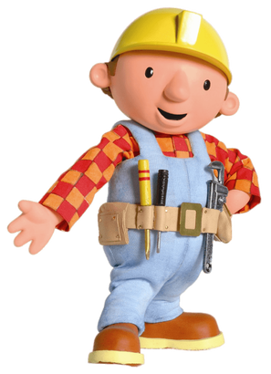

# Watch Me Build

Want to build flappy bird? Train an AI model to recognize hand gestures? Or perhaps a website using PHP (I know very old!)? Well if you are confused, you can watch me build and try it on your own!

### Projects

*	[Hand Gesture Estimation](Hand%20Gesture%20Estimation/)
*	[Time Series Forecasting](Time%20Series%20Forecasting/)
*	[Digit Recognizer](Digit%20Recognizer/)
*	[E-Commerce Website](E-Commerce%20Website/)
*	[L-Systems](L-Systems/)
*	[Flappy Bird](Flappy%20Bird/)
*	[Snake](Snake/)
*	[Space Invaders](Space%20Invaders/)
*	[Pop Balls](Pop%20Balls/)
*	[2048](2048/)
*	[Four Colors](Four%20Colors/)
*	[Fractal Ferns](Fractal%20Ferns/)
*	[Fractal Tree](Fractal%20Tree/)
*	[Tic-Tac-Toe](Tic-Tac-Toe/)
*	[Mandelbrot & Julia Set](Mandelbrot%20&%20Julia%20Set/)
*	[Sierpinski Triangle](Sierpinski%20Triangle/)
*	[XOR Problem](XOR%20Problem/)
*	[Color Classifier](Color%20Classifier/)
*	[Polynomial Regression](Polynomial%20Regression/)