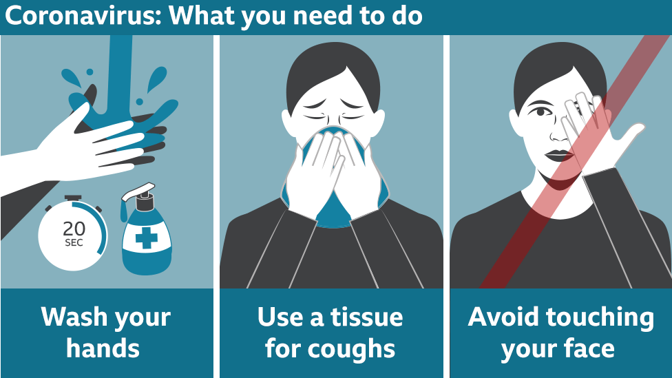

# Time Series Forecasting

## Introduction

Coronavirus (COVID-19) is an infectious disease causing a pandemic around the world. A pandemic disease spreads very quickly i.e., at an exponential rate. Most people affected experience respiratory illness and recover without special treatment. However, for older people it is a different story. People over the age of 65 experience underlying medical problems like diabetes, chronic respiratory pain, cardiovascular disease, and even cancer in certain cases. Hence, it is very important we keep ourselves aware and take precautionary measures.

The goal of this project is to forecast the spread of COVID-19 and its future consequences using the statistical model ARIMA.

### Install dependencies

You will require the following dependencies:

* [Python 3](https://www.python.org/downloads/)
* [Numpy](https://www.scipy.org/install.html)
* [Matplotlib](https://matplotlib.org/3.1.1/users/installing.html)
* [statsmodels](https://www.statsmodels.org/stable/install.html)